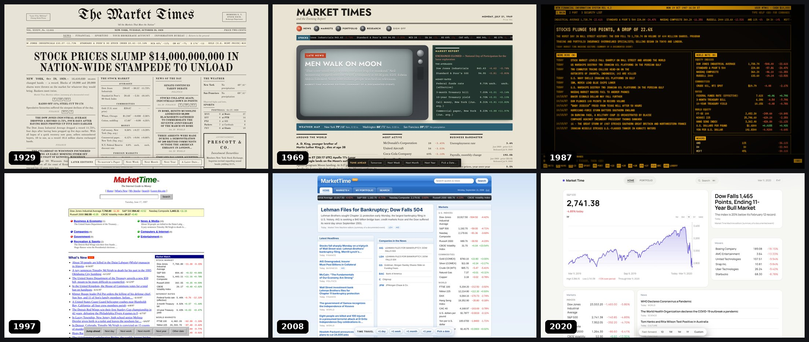

# Market Time Machine

**Travel to any date in market history and invest using only what was knowable that day.**


Type a date (`October 19, 1987`, `the day Lehman failed`, `moon landing`). The app then acts as if that evening is the present. News, prices, economic numbers, sports scores, company profiles, search results and even the interface come from that day. You get a fictional $10,000 to invest, then fast-forward a day, a month or a decade to see what happened.



## Why I built it

Most "what if you'd bought X in 1987" tools quietly cheat. They show a split-adjusted price nobody ever saw, an unemployment figure that was revised two years later, and a company description written with hindsight. I wanted to see what investing actually *felt like* with only the information people had at the time. That turned into an engineering problem. How do you guarantee that nothing from the future leaks onto the screen, across ~630 data files, ten free data sources, and 200 years?

## Features

- **Natural-language time travel.** Accepts exact dates, partial dates ("March 2000") and named moments ("Black Monday", "9/11", "covid"), followed by a skippable time-travel transition.
- **A strict information boundary.** Every news item, quote, statistic and score carries an `availableAt` date. A single gate drops anything later than the simulated day, and it fails closed.
- **Real historical data, no API keys:**
  - Daily prices for ~100 indexes, futures and stocks back to 1927.
  - ~186k dated news items.
  - ~389k game results across MLB, NBA, NFL, NHL and international soccer.
  - Billboard No. 1s and box-office hits.
  - Actual NOAA weather observations.
  - Scanned newspaper front pages from the Library of Congress.
- **Point-in-time correctness.** Prices are shown as they were quoted then: IBM was $103¼ on Black Monday, not its split-adjusted $24. Tickers and names change over time (XON → XOM, FB → META). Tesla doesn't exist in 1995. Fractions are used until 2001, and dividends are paid into your cash.
- **20 sub-eras on 11 interface designs, each with its own way to navigate:**
  - 1920s: a broadsheet with section headings.
  - 1960s: a TV with a channel dial.
  - 1980s: an amber trading terminal with a working command line (`IBM`, `BUY IBM 10`, `+1M`, F-keys).
  - 1997: a Yahoo-style directory.
  - 2005: glossy tabs and dropdowns.
  - Today: a minimal dashboard with a ⌘K command palette.
- **A portfolio with a reckoning.** Buy and sell at that day's prices, advance time, and get a period review with returns against the S&P 500 and the major events you lived through.
- **Honest about its sources.** Every value is tagged REAL, ARCHIVAL, DERIVED or MOCK (press **Shift+D** to see the tags). Any estimated price shows a †. Each page links to its sources, worded for its era.

## Tech stack

| Area | Tools |
|---|---|
| Frontend | React 18, TypeScript (strict), Vite 5 |
| Styling | Hand-written CSS with per-era design tokens; no UI framework |
| Testing | Vitest: information-boundary unit tests and a random-date audit of the real dataset |
| Data pipeline | Node.js scripts producing gzipped JSON, decompressed in the browser with `DecompressionStream` |
| Hosting | Fully static (no backend), so it can be deployed to any static host |

## Run it locally

You need [Node.js](https://nodejs.org) 18.17 or newer. No database, Docker or API keys.

```bash
git clone https://github.com/jtouevsky/market-time-machine.git
cd market-time-machine
npm install
npm run dev          # open the http://localhost:5173 link it prints
```

| Command | What it does |
|---|---|
| `npm run dev` | Dev server with hot reload |
| `npm test` | Runs the test suite (37 tests) |
| `npm run build` | Type-check + production build to `dist/` |
| `npm run start` | Build, then serve the production version locally |
| `npm run build:single` | A single offline HTML file in `dist-single/` (curated data only) |
| `npm run data:refresh` | Rebuild every dataset from the original public sources (optional, 20–40 min) |

Optional settings are documented in [`.env.example`](.env.example). Copy it to `.env` to use them.

## Interesting technical problems

**1. One gate for everything that crosses the time boundary.**
The UI never talks to a data source directly. Every source goes through a single function, [`createGuardedProvider`](src/data/guardedProvider.ts). This includes eight build-time archives, two live browser-side APIs and a curated fallback dataset. The gate refuses any request for a date past the simulation clock and re-checks every returned item against [`isInformationAvailable`](src/core/availability.ts). That check fails closed: a missing or malformed date counts as "not yet known". When you advance time, the clock moves *before* the app asks about the new date, so a slow request from the old date can't return results from the new one.

**2. "Available" is not the same as "happened."**
Each kind of data needed its own rule for when it becomes knowable:

- **Economic data** uses ALFRED vintages, the archive of each number *as first published*. August 2008's unemployment rate becomes knowable in September, at the first-published value, not today's revised one.
- **Sports results** become knowable the morning after the game; **box office**, the Monday after the weekend.
- **A news event dated as a range** ("October 24–29") is filed under its last day.
- **Market quotes** use the last trading session on or before the date. This handles weekends, the NYSE's old Saturday sessions and special closures like 9/11 week and the moon-landing holiday.

**3. Removing hindsight from Wikipedia.**
Wikipedia's chronologies are written with hindsight, so the text needed scrubbing:

- **Retrospective phrasing:** a news filter drops items that mention later years or say "would later…" / "which was later found…".
- **Renamed article titles:** retrospective ranges like "Iraqi Civil War (2014–2017)" are stripped from day-of headlines.
- **Birth notices** were the worst leak, because they describe a baby by its future career. Before the filter, one date in 1994 surfaced "Dylann Roof, white supremacist and mass murderer" as news. These now have a dedicated filter and regression tests that run across 15 dates.

**4. Prices as people actually saw them.**
Free market data is split-adjusted. The app reverses this: the printed price is the adjusted close multiplied by every split that happened *after* the simulated date. That gives the real nominal quote, while charts stay on the share basis in force that day. Securities carry point-in-time names, tickers and exchanges, and list only between their first and last trading days. Prices print in eighths until June 1997 and sixteenths until April 2001.

**5. Real data with no backend and no keys.**
The data is processed at build time into ~630 delta-encoded, gzipped JSON files (37 MB total). The browser fetches and decompresses only the year it needs. A context aggregator loads the page module by module (markets, news, economy, sports, weather…), each with its own timeout, cache and fallback. A slow or failed source empties just its panel instead of breaking the page. Two sources (NOAA weather and Library of Congress front pages) are called live from the browser, with request de-duplication and a one-year local cache.

**6. Interfaces with different structures, not just different colours.**
The era system controls the information architecture, not just the colours: navigation model, search UI, number formatting, labels, layout grid and how you advance time. For example, the 1987 terminal is a real command parser with its own help screen, and the 1960s layout navigates by channel. Underneath, all 20 sub-eras use the same guarded data layer.

## Project structure

```
src/
  core/          dates & NYSE calendar, natural-language date parser, types, availability rule
  data/
    guardedProvider.ts   the single information gate
    realProvider.ts      combines real sources first, labelled fallbacks second
    aggregator.ts        per-module loading with timeouts, cache, graceful failure
    real/                loaders for markets, macro data, news/sports/culture archives
    mock/                curated fallback dataset
  theme/eras.ts  11 layouts × 20 sub-eras
  components/    portal (landing + transition), world (layouts, headers, terminal, ⌘K), modules
  __tests__/     boundary tests + real-data audit
scripts/data/    build-time data pipeline (one fetcher per source + build-all)
public/data/     pre-built datasets (committed so the app runs right after cloning)
```

## Future improvements

- **A live demo link.** Deploy to GitHub Pages or Vercel. The data loader already respects Vite's `base` path.
- **Broader market coverage,** including delisted companies (Lehman, Enron) from a source that keeps dead tickers.
- **Point-in-time fundamentals** from SEC EDGAR filings, available as of their filing date.
- **Tennis results** and more international leagues.
- **Code-splitting per era,** so each visit downloads only one layout.
- **A shareable "challenge" mode:** the same date and the same $10,000, comparing returns against friends.

## Data sources and attribution

All sources are free and keyless:

- **Markets:** Yahoo Finance and FRED/ALFRED (Federal Reserve Bank of St. Louis), including the NBER Macrohistory series.
- **Weather:** NOAA NCEI GHCN-Daily.
- **Newspapers:** Library of Congress *Chronicling America*.
- **News, music and box-office history:** Wikipedia (CC BY-SA 4.0).
- **Sports:** FiveThirtyEight (CC BY 4.0), nflverse (CC BY 4.0), the NHL stats API and the international football results dataset.

*The baseball information used here was obtained free of charge from and is copyrighted by Retrosheet. Interested parties may contact Retrosheet at www.retrosheet.org.*

Values the app *estimates* (for example the Dow before 1928, some commodity quotes and Bitcoin before 2014) are labelled MOCK and marked with †. Weather is never invented.

## License

[MIT](LICENSE) © 2026 jtouevsky
